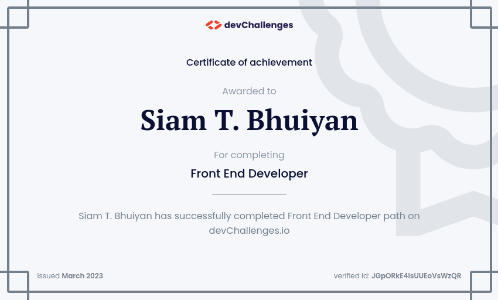

<h1 align="center">Front-end Developer</h1>

   Solutions for the path "Front-end Developer" from  <a href="http://devchallenges.io" target="_blank">Devchallenges.io</a>.

 

## Table of Contents

- [Button Component](https://github.com/siamtbhuiyan/devChallenges/tree/main/Front-end%20Developer/button-component)
- [Input Component](https://github.com/siamtbhuiyan/devChallenges/tree/main/Front-end%20Developer/input-component)
- [Windbnb](https://github.com/siamtbhuiyan/devChallenges/tree/main/Front-end%20Developer/windbnb)
- [Todo App](https://github.com/siamtbhuiyan/devChallenges/tree/main/Front-end%20Developer/todo-app)
- [Quote Generator](https://github.com/siamtbhuiyan/devChallenges/tree/main/Front-end%20Developer/quote-generator)
- [Country Quiz](https://github.com/siamtbhuiyan/devChallenges/tree/main/Front-end%20Developer/country-quiz)
- [Weather App](https://github.com/siamtbhuiyan/devChallenges/tree/main/Front-end%20Developer/weather-app)
- [Search Jobs](https://github.com/siamtbhuiyan/devChallenges/tree/main/Front-end%20Developer/search-jobs)

## Certificate

[Certificate](https://devchallenges.io/certificates/JGpORkE4IsUUEoVsWzQR)

