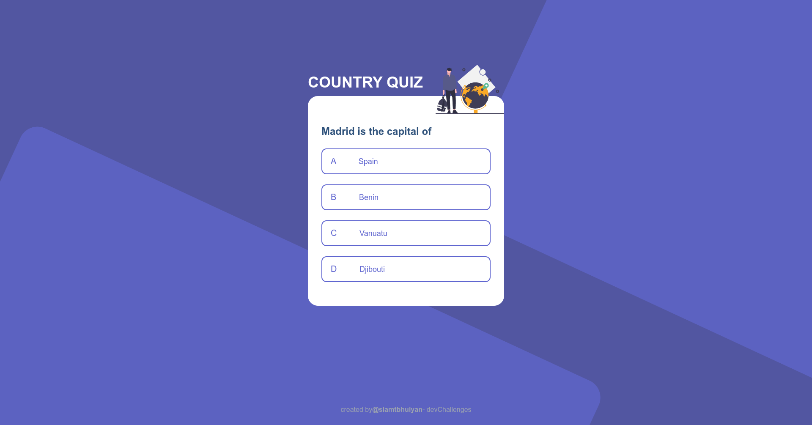
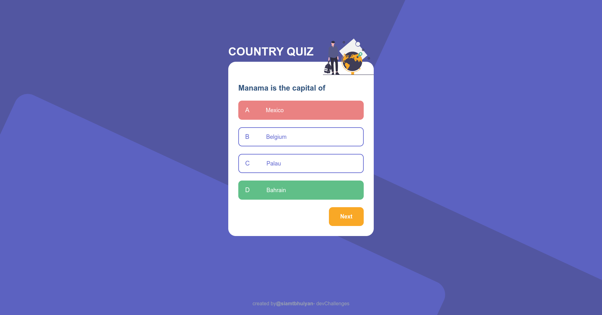
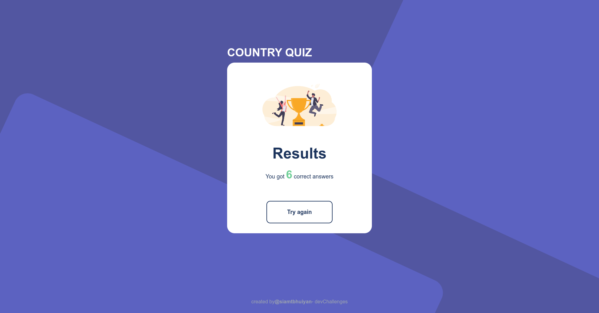
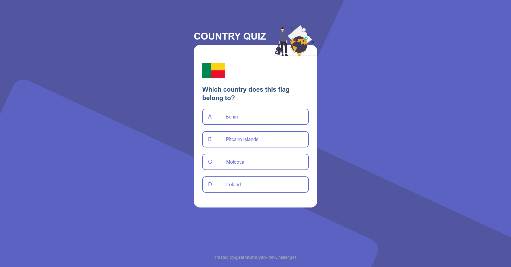

<!-- Please update value in the {}  -->

<h1 align="center">Country Quiz</h1>

<div align="center">
   Solution for a challenge from  <a href="http://devchallenges.io" target="_blank">Devchallenges.io</a>.
</div>

<div align="center">
  <h3>
    <a href="https://country-quiz-000.netlify.app/">
      Demo
    </a>
    <span> | </span>
    <a href="https://devchallenges.io/solutions/1qlSE0egxnFk3dntCZOp">
      Solution
    </a>
    <span> | </span>
    <a href="https://devchallenges.io/challenges/Bu3G2irnaXmfwQ8sZkw8">
      Challenge
    </a>
  </h3>
</div>

<!-- TABLE OF CONTENTS -->

## Table of Contents

- [Overview](#overview)
  - [Built With](#built-with)
- [Features](#features)
- [How to use](#how-to-use)
- [Contact](#contact)

<!-- OVERVIEW -->

## Overview






### Built With

- [Vue.js](https://vuejs.org/)
- [Tailwind](https://tailwindcss.com/)

## Features

<!-- List the features of your application or follow the template. Don't share the figma file here :) -->

This application/site was created as a submission to a [DevChallenges](https://devchallenges.io/challenges) challenge. The [challenge](https://devchallenges.io/challenges/Bu3G2irnaXmfwQ8sZkw8) was to build an application to complete the given user stories.

- User story: I can see at least 2 types of questions: a city is the capital of.. or a flag belong to country..
- User story: I can see select an answer
- User story: I can see if my answer is correct or incorrect
- User story: When I answer correctly, I can move on to the next question
- User story: When I answer incorrectly, I can see my results and try again
- User story: I can try again

## How To Use

<!-- Example: -->

To clone and run this application, you'll need [Git](https://git-scm.com) and [Node.js](https://nodejs.org/en/download/) (which comes with [npm](http://npmjs.com)) installed on your computer. From your command line:

```bash
# Clone this repository
$ git clone https://github.com/siamtbhuiyan/devChallenges

# Go to the project directory
$ cd 'Front-end Developer'/country-quiz

# Install dependencies
$ npm install

# Run the app
$ npm run dev
```

## Contact

- GitHub [@siamtbhuiyan](https://github.com/siamtbhuiyan)
