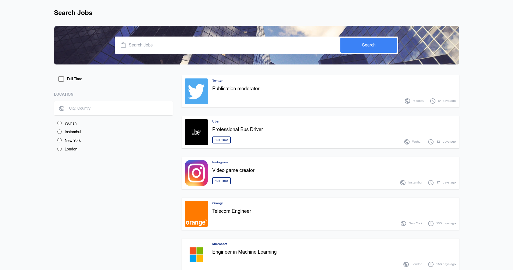
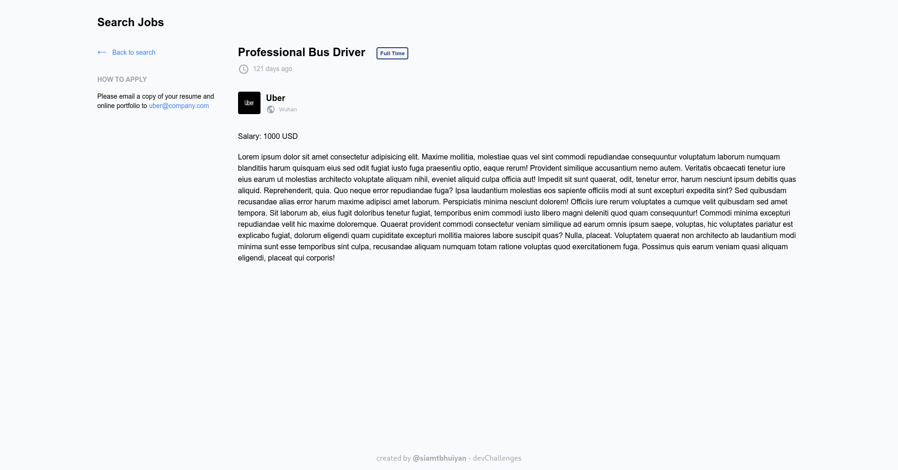
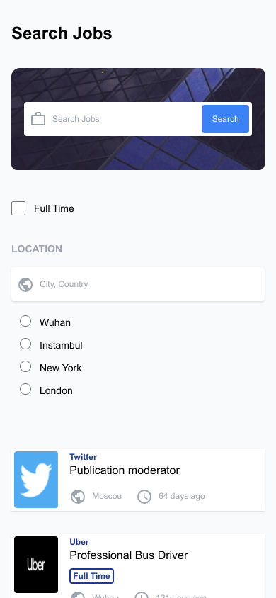
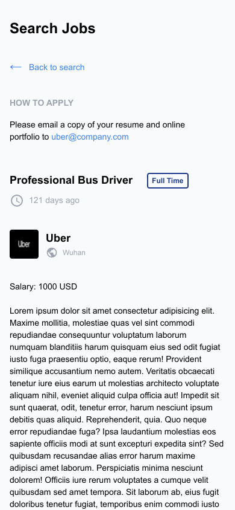

<!-- Please update value in the {}  -->

<h1 align="center">Search Jobs</h1>

<div align="center">
   Solution for a challenge from  <a href="http://devchallenges.io" target="_blank">Devchallenges.io</a>.
</div>

<div align="center">
  <h3>
    <a href="https://search-jobs.netlify.app/">
      Demo
    </a>
    <span> | </span>
    <a href="https://devchallenges.io/solutions/XZjqRQkc6mInymILuzuI">
      Solution
    </a>
    <span> | </span>
    <a href="https://devchallenges.io/challenges/TtUjDt19eIHxNQ4n5jps">
      Challenge
    </a>
  </h3>
</div>

<!-- TABLE OF CONTENTS -->

## Table of Contents

- [Overview](#overview)
  - [Built With](#built-with)
- [Features](#features)
- [How to use](#how-to-use)
- [Contact](#contact)
- [Acknowledgements](#acknowledgements)

<!-- OVERVIEW -->

## Overview






### Built With

<!-- This section should list any major frameworks that you built your project using. Here are a few examples.-->

- [React](https://reactjs.org/)
- [Tailwind](https://tailwindcss.com/)

## Features

<!-- List the features of your application or follow the template. Don't share the figma file here :) -->

This application/site was created as a submission to a [DevChallenges](https://devchallenges.io/challenges) challenge. The [challenge](https://devchallenges.io/challenges/TtUjDt19eIHxNQ4n5jps) was to build an application to complete the given user stories.

- User story: I can see a list of jobs by default
- User story: I can search for jobs with a given keyword
- User story: I can search for jobs with a city
- User story: I can select one option from at least 4 pre-defined options
- User story: I can search for a full-time job only
- User story: I can see a list of jobs with their logo, company name, location, and posted time.
- User story: When I select a job, I can see job descriptions and how to apply like the given design.
- User story: When I am on the job details page, I can go back to the search page
- User story (optional): I can see jobs on different pages, 5 items on each page

## How To Use

<!-- Example: -->

To clone and run this application, you'll need [Git](https://git-scm.com) and [Node.js](https://nodejs.org/en/download/) (which comes with [npm](http://npmjs.com)) installed on your computer. From your command line:

```bash
# Clone this repository
$ git clone https://github.com/siamtbhuiyan/devChallenges

# Go to the project directory
$ cd 'Front-end Developer'/search-jobs

# Install dependencies
$ npm install

# Run the app
$ npm run dev

```

## Acknowledgements

<!-- This section should list any articles or add-ons/plugins that helps you to complete the project. This is optional but it will help you in the future. For example: -->

- [Material UI Icons](https://mui.com/material-ui/material-icons/)

## Contact

- GitHub [@siamtbhuiyan](https://github.com/siamtbhuiyan)
